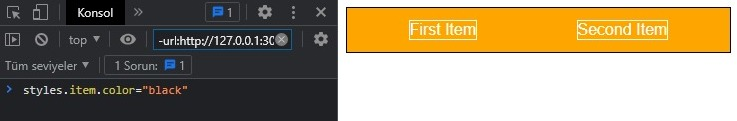
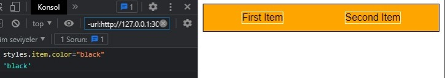

# DYNA-CSS
Variable Based Dynamic Css Library

# Usage
```html
<!--You can use multiple variables-->
<div css="items spaceAround">
    <span css="item">First Item</span>
    <span css="item">Second Item</span>
</div>
```
```js
//First Method
let styles=document.css({
items:{
  display:"flex",
  alignItems:"center",
  padding:"12px",
  border:"1px solid black",
},
spaceAround:{
    justifyContent:"space-around"
},
item:{
    border:"white 1px solid"
}
})

//You can update after
let items=styles.items

items.color="white";
items.backgroundColor="orange"


/*
Alternative usage

let [style,settings]=css({
    blue:{
    backgroundColor:"blue"
    }
})

//You can add multiple elements
settings.init(document)
settings.init(document.querySelector(".other"))
*/
```
<hr>

## Before After
### Before


### After


# Installations

## Global
```
<script src="https://unpkg.com/dyna-css@1.0.0/dynacss.js"></script>
```

## Module
```
import {css} from "https://unpkg.com/dyna-css@1.0.0/dynacss.mjs"
```

## Npm
```
npm i dyna-css
```
